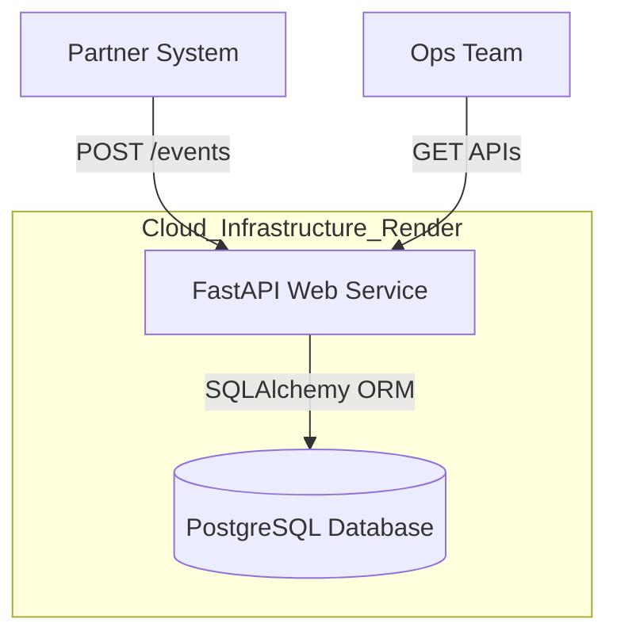
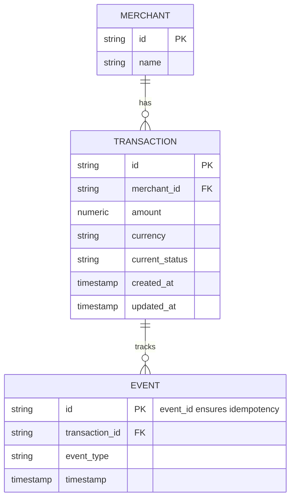
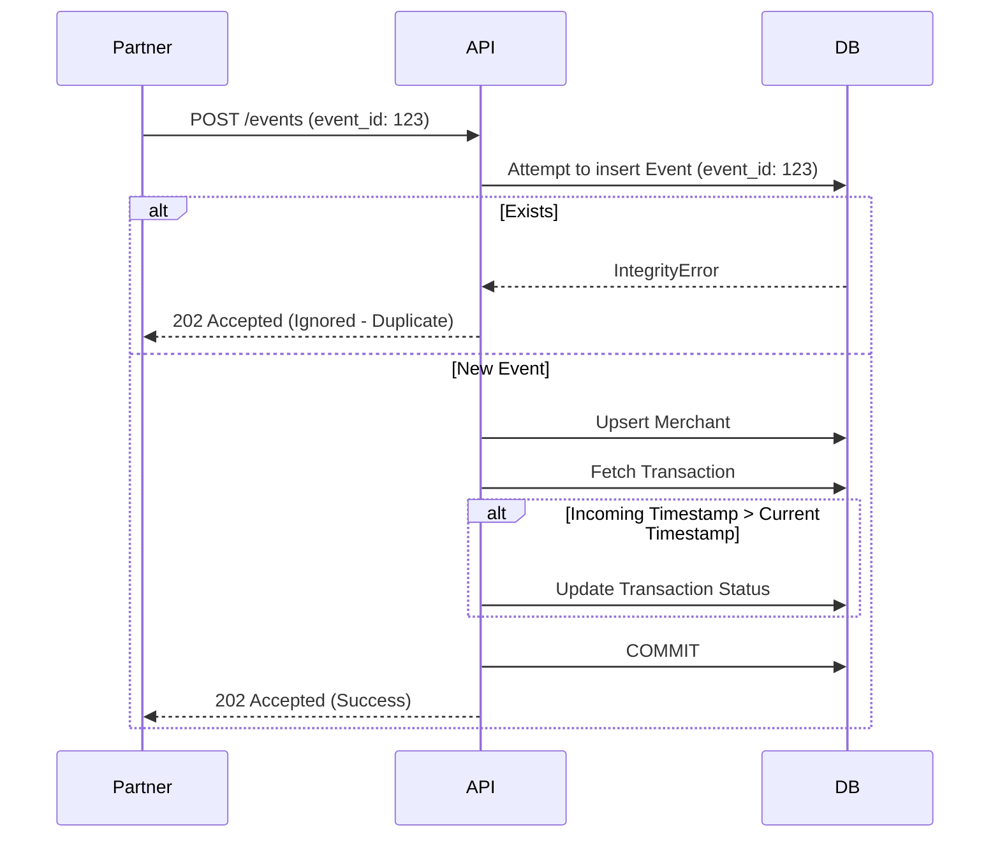

# Fintech Reconciliation Service

A lightweight, production-ready backend service designed to ingest payment lifecycle events, maintain transaction reconciliation state, and expose reporting APIs for operations teams. 

Built for the **Solutions Engineer Take-Home Assignment**.

### 🔗 Quick Links
* **Live API Base URL:** [https://fintech-recon-api.onrender.com](https://fintech-recon-api.onrender.com) *(Replace with your Render URL)*
* **Interactive API Docs (Swagger):** [Live Swagger UI](https://fintech-recon-api.onrender.com/docs#/)
* **Video Demo / Walkthrough:** [https://drive.google.com/drive/folders/1VeAqyTz6yR6VNVBLF1u1asegZOhDGe2C](https://drive.google.com/drive/folders/1VeAqyTz6yR6VNVBLF1u1asegZOhDGe2C)
* **Postman Collection:** [Link to your Postman workspace or mention the `.json` file exported in this repo]

> **⚠️ Note on Live Deployment:** This service is deployed on Render's free tier. If the service has been inactive for 15 minutes, it spins down to sleep. **The very first request you make may take up to 60 seconds to execute** while the container wakes up. Subsequent requests will be lightning fast.

---

## 📊 Dataset Overview
The system is designed to handle realistic, messy financial data streams. The provided `sample_events.json` contains:
- **~10,000+ events** across **5 distinct merchants**.
- A realistic mix of successful transactions, failures, and pending settlements.
- **190 Duplicate Events:** Intentionally included to validate strict database idempotency.
- **Inconsistent Records:** Transactions with logical breaks (e.g., marked `settled` but containing a `payment_failed` event) to test discrepancy reporting.

---

## 🏗 System Architecture (HLD)

The system is built using **FastAPI** and **PostgreSQL**, fully containerized via Docker. It handles high-throughput event ingestion while maintaining strict ACID compliance and idempotency.



# 🚀 Deployment Strategy

The application is deployed on **Render** for seamless, cost-effective hosting:

- **Web Service**: Runs the FastAPI application using the provided Dockerfile.
- **Database**: A Managed PostgreSQL instance hosted on the same internal network for secure, low-latency querying.

---

# 🗄️ Data Architecture & Schema (ERD)

The database is normalized into three core tables: **merchants**, **transactions**, and **events**.


## Schema Design Decisions

* **Indexes**
  A composite index is created on `(merchant_id, current_status)` in the `transactions` table to heavily optimize Ops dashboard queries and aggregations.

* **Historical Tracking**
  Every payload is stored immutably in the `events` table, creating an exact audit log for every transaction.

---

## ⚙️ Core Logic & Edge Case Handling (LLD)

In fintech, event streams are inherently messy. The ingestion pipeline (`POST /events`) handles three critical failure modes:

### 1. Idempotency (Duplicate Events)

If the network drops, partners often retry sending the same event.

**Solution:**

* The `event_id` is used as the **Primary Key** in the `events` table.
* If a duplicate arrives, PostgreSQL throws an `IntegrityError`.
* The API catches this, rolls back the transaction, and returns a safe `202 Accepted` response with a status of `"ignored"`.

## 2. Out-of-Order Delivery

An event claiming a transaction is settled might arrive before the `payment_processed` event due to asynchronous queues.

**Solution:**
We track `updated_at` (mapped to the event's chronological timestamp). The state machine only updates the `current_status` if the incoming event's timestamp is **strictly greater** than the currently stored timestamp.

---

## Code Snippet



---

## 🔌 API Documentation

Detailed interactive documentation can be found at the `/docs` endpoint of the live service.

### 1. Ingest Events (`POST /events`)

Accepts payment lifecycle payloads.

* **Success:**

  ```json
  {"status": "success", "message": "Event processed"}
  ```

* **Duplicate (Handled):**

  ```json
  {"status": "ignored", "message": "Duplicate event"}
  ```

---

### 2. List Transactions (`GET /transactions`)

Supports query parameters:

* `merchant_id`
* `status`
* `skip`
* `limit`

---

### 3. Fetch Transaction Details (`GET /transactions/{transaction_id}`)

Returns transaction details alongside its chronological event history.

---

### 4. Reconciliation Summary (`GET /reconciliation/summary`)

Performs SQL `GROUP BY` aggregations to instantly return:

* Total counts
* Volumes grouped by **Merchant** and **Status**

This approach avoids Python memory bloat.

---

### 5. Reconciliation Discrepancies (`GET /reconciliation/discrepancies`)

Returns transactions violating the logical state machine:

* Transactions marked **settled** but containing a `payment_failed` event
* Transactions marked **processed** or **settled** but missing an initial `payment_initiated` event

---

## 💻 Local Setup & Testing

### Prerequisites

* Docker & Docker Compose
* Python 3.9+

---

### Running the App

1. **Clone the repository:**

   ```bash
   git clone https://github.com/YOUR_GITHUB_USERNAME/fintech-recon-service.git
   cd fintech-recon-service
   ```

2. **Start the Database and API via Docker:**

   ```bash
   docker-compose up -d --build
   ```

The API will be available at:
👉 [http://localhost:8000/docs](http://localhost:8000/docs)

---

### Seeding the Data

To test the ingestion pipeline, use the provided resilient `seed.py` script.
It reads `sample_events.json` and uses a `requests.Session()` with automatic HTTP retries to simulate a partner system.

1. **Create a virtual environment and install dependencies:**

   ```bash
   python3 -m venv venv
   source venv/bin/activate
   pip install requests "urllib3<2"
   ```

2. **Run the script:**

   ```bash
   python seed.py
   ```

The script will output exact counts of:

* Successes
* Ignored duplicates
* Errors

